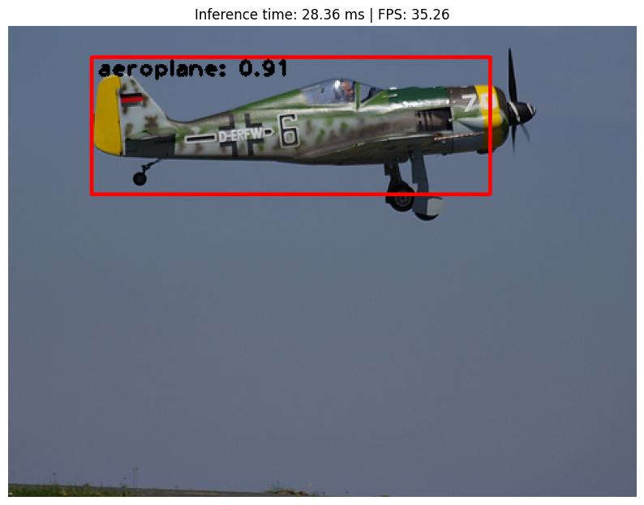
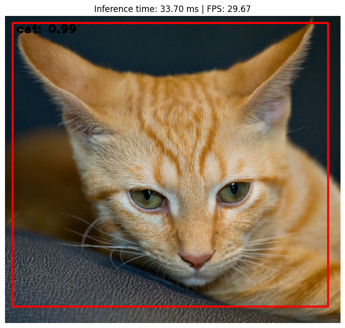
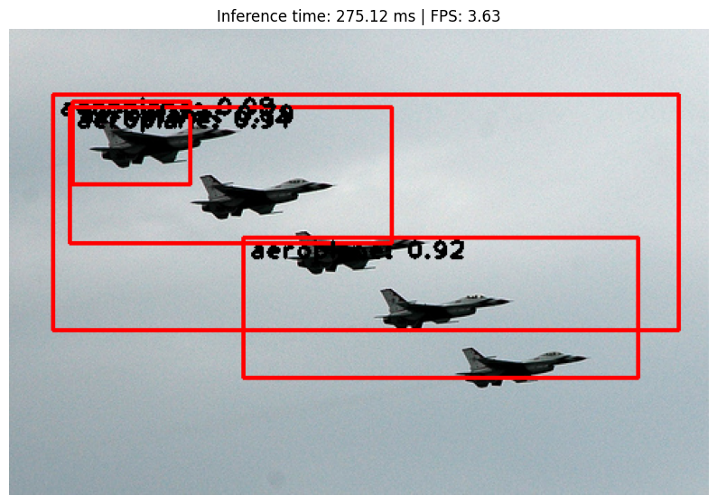
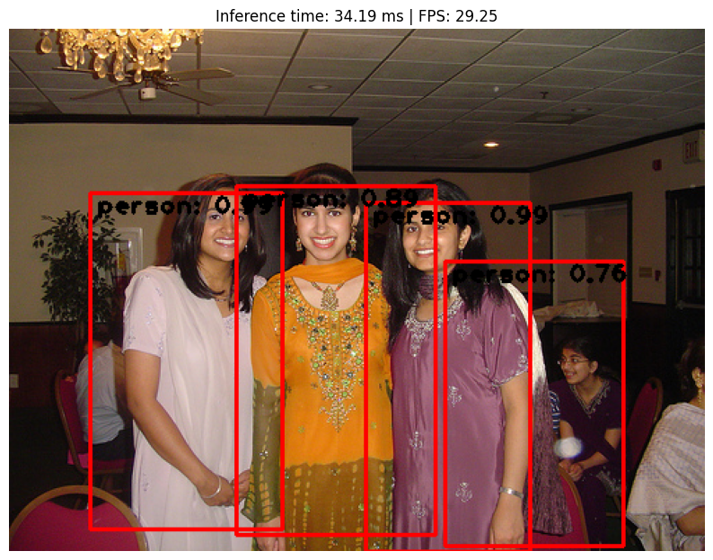
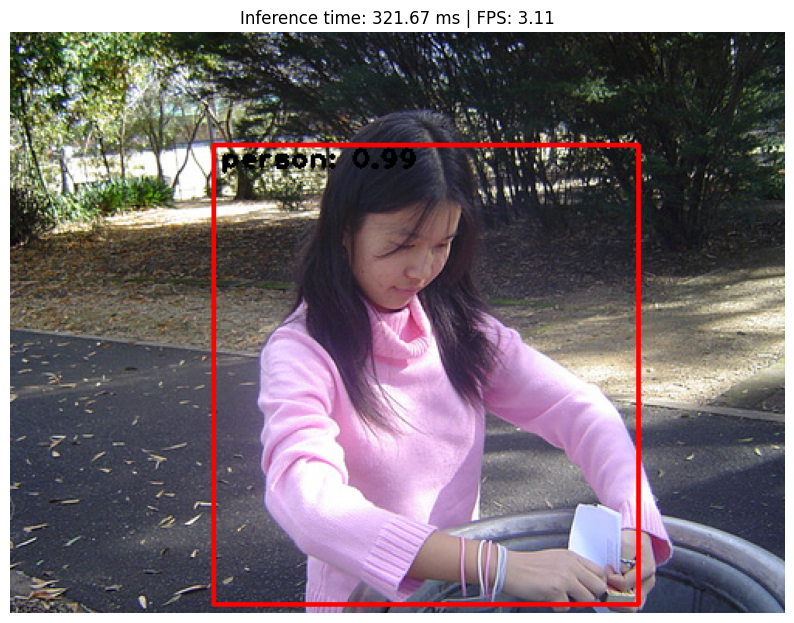
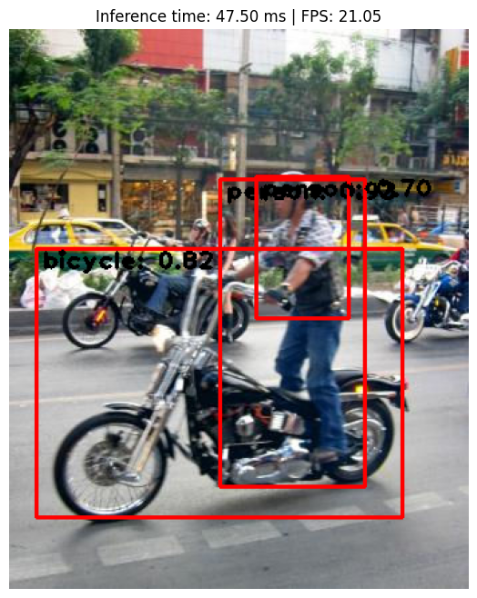

# Faster R-CNN From Scratch for Custom Object Detection

## 1. Project Overview
This project implements a **complete object detection pipeline trained entirely from scratch**, without using any pre-trained weights. A **Faster R-CNN–style two-stage detector** is built and trained on a filtered subset of the **PASCAL VOC 2012** dataset, focusing on five object categories.

The objective of this project is **not to maximize benchmark performance**, but to gain a deep, end-to-end understanding of modern object detection systems, including **region proposal generation, multi-task loss optimization, and training dynamics of two-stage detectors**.


## 2. Dataset

### Dataset Source
- **PASCAL VOC 2012**
- Downloaded from Kaggle
- Original annotations in **VOC XML** format

### Selected Classes
The dataset is filtered to include only the following five classes: ```["person", "car", "cat", "aeroplane", "bicycle"]```

All images that do not contain **at least one instance** of these classes are removed.

### Dataset Splits
Official **VOC ImageSets** are used to create the training and validation splits.

| Split | Original Images | Images After Filtering |
|------|----------------|------------------------|
| Train | 5,717 | 3,377 |
| Val   | 5,823 | 3,458 |

After filtering, the dataset contains **only images with valid target objects** from the selected classes.


## 3. Model Architecture
This project implements a **custom Faster R-CNN architecture trained from scratch**, consisting of the following components:

### Backbone Network
- Custom CNN feature extractor  
- No ImageNet or external pretraining  
- Multiple convolutional blocks for hierarchical feature learning  

### Region Proposal Network (RPN)
- Shared convolutional feature map with the backbone  
- Anchor-based proposal generation  
- Binary classification (object vs background)  
- Bounding box regression for anchor refinement  

### ROI Head
- Region of Interest (ROI) pooling  
- Fully connected layers for:
  - Multi-class classification  
  - Bounding box regression  

The entire model is trained **end-to-end** using a combined multi-task loss.

The following section explains the motivation behind these design choices and
provides an overview of how the architecture is implemented in code.


## 4. Model Design Rationale and Implementation Details

### Choice of Architecture
Faster R-CNN was selected as the core detection architecture due to its clear separation of concerns between **region proposal generation** and **object classification**, making it particularly suitable for studying the internal mechanics of object detection systems. Unlike single-stage detectors (e.g., YOLO or SSD), Faster R-CNN explicitly models objectness through a Region Proposal Network (RPN), which provides deeper insight into how candidate regions are generated, refined, and classified. This architectural clarity makes Faster R-CNN well-suited for educational and experimental settings where interpretability and correctness are prioritized over raw inference speed.

The model is trained **entirely from scratch**, without ImageNet or COCO pretraining, ensuring that all learned representations arise solely from the target dataset. While this choice negatively impacts final accuracy, it provides a more faithful understanding of optimization challenges in deep detection models, such as unstable RPN training, slow convergence, and sensitivity to dataset size and class imbalance. Training from scratch also highlights the importance of dataset filtering, anchor design, and loss balancing in two-stage detectors.

A custom CNN backbone is used instead of standard architectures such as ResNet or VGG to maintain full control over architectural complexity and parameter count. This avoids implicit performance gains from well-engineered pretrained backbones and keeps the focus on **core detection principles** rather than architectural shortcuts.

### Region Proposal Network (RPN)
The Region Proposal Network operates on shared convolutional feature maps produced by the backbone. It predicts objectness scores and bounding box offsets for a dense set of anchors at each spatial location. Anchors are refined through bounding box regression, and high-confidence proposals are forwarded to the ROI head. This shared-feature design significantly reduces computational overhead compared to earlier R-CNN variants while maintaining strong localization performance.

The RPN contributes two loss terms during training:
- A binary classification loss for object vs background discrimination  
- A localization loss for anchor box refinement  

These losses are optimized jointly with downstream Fast R-CNN losses in an end-to-end manner.

### ROI Head and Detection Head
Proposed regions from the RPN are passed through ROI pooling to produce fixed-size feature representations, regardless of proposal size. These features are processed by fully connected layers that output:
- Class probabilities over the target object categories  
- Bounding box regression offsets for class-specific localization  

This separation allows the model to specialize proposal generation and final classification independently, improving localization accuracy at the cost of increased computational complexity.

### Training Strategy and Code Structure
The training pipeline is implemented in a modular fashion to reflect the logical structure of Faster R-CNN. The dataset loader handles image parsing, annotation loading, bounding box normalization, and data augmentation. During training, each batch passes through the backbone, RPN, and ROI head sequentially, with intermediate outputs used to compute multi-task losses.

Key implementation details include:
- **Batch size of 1**, consistent with standard Faster R-CNN training practices due to variable image sizes and memory constraints  
- **Gradient accumulation**, used to stabilize updates and simulate larger effective batch sizes  
- **MultiStep learning rate scheduling**, enabling coarse-to-fine optimization  
- Explicit tracking of individual loss components for debugging and analysis  

The training loop is intentionally designed to remain transparent and debuggable, prioritizing clarity over abstraction. This makes it easier to analyze failure modes such as poor proposal quality, class imbalance effects, and bounding box regression instability.

### Design Trade-offs
While Faster R-CNN is computationally heavier and slower than single-stage detectors, it offers superior localization accuracy and interpretability. The architecture is therefore well-suited for scenarios where detection quality and understanding model behavior are more important than real-time inference constraints. This project demonstrates that, even without pretraining, Faster R-CNN remains a strong baseline for accuracy-focused object detection tasks when trained carefully.

## 5. Training Setup

### Hardware
- **GPU**: NVIDIA RTX 4080  
- **Training Time**: ~3.5 minutes per epoch  
- **Total Epochs**: 20  

### Optimization
- **Optimizer**: SGD  
- **Momentum**: 0.9  
- **Weight Decay**: 5e-4  
- **Learning Rate Scheduler**: MultiStepLR  
- **Batch Size**: 1  
- **Gradient Accumulation**: Enabled  

### Loss Functions
The total training loss is the sum of four components:
- RPN classification loss  
- RPN localization (bounding box regression) loss  
- Fast R-CNN classification loss  
- Fast R-CNN localization loss  

This closely follows the original **Faster R-CNN multi-task training objective**.


## 6. Data Augmentation

Data augmentation is applied selectively during training to improve robustness while maintaining stability when training the model from scratch.

### Implemented Augmentations
- **Random horizontal flip** (50% probability), with bounding boxes adjusted accordingly  
- **Color jitter**, including:
  - Brightness jitter  
  - Saturation jitter  
- **Gaussian blur** applied with low probability to simulate mild image degradation  

All augmentations are applied **only during training** and are chosen such that bounding box geometry remains valid.

> **Note:** More aggressive geometric augmentations (e.g., random cropping, rotation, perspective transforms) were intentionally avoided, as they require complex bounding box remapping and can destabilize training in two-stage detectors trained from scratch.


## 7. Quantitative Evaluation

### Mean Average Precision (IoU = 0.5)

| Class      | AP     |
|-----------|--------|
| Aeroplane | 0.4127 |
| Bicycle   | 0.2639 |
| Car       | 0.1725 |
| Cat       | 0.4753 |
| Person    | 0.3141 |
| **mAP**   | **0.3277** |

### Inference Performance

| Metric                  | Value        |
|------------------------|--------------|
| Average inference time | 35.39 ms     |
| Inference FPS          | 28.25 FPS    |
| Device                 | NVIDIA RTX 4080 |

### Model Size

| Metric                  | Value     |
|------------------------|-----------|
| Model size (disk)      | 167.36 MB |
| Number of parameters   | 43.87 M   |


## 8. Qualitative Results

### Sample Predictions
Inference examples with predicted bounding boxes and class confidences are shown below:
<p align="center">
  
  
  
  
  
  
</p>

### Real-Time Inference Demo
A real-time inference video demonstrating bounding box stability and detection speed is provided below:
<p align="center">
  
</p>


> **Note:** The video is recorded directly from notebook inference and demonstrates real-time detection performance without post-processing.

These qualitative results demonstrate **bounding box localization quality, class predictions, and real-time inference behavior**.


## 9. Results Discussion

The model achieves an **mAP of 0.3277**, which is consistent with expectations for a **Faster R-CNN trained entirely from scratch** on a limited dataset. Higher AP is observed for visually distinctive classes such as *cat* and *aeroplane*, while classes with greater intra-class variation (e.g., *car* and *bicycle*) exhibit lower AP.

Despite the lack of pretraining, the model achieves an inference speed of **~28 FPS**, demonstrating an efficient implementation and reasonable runtime performance for a two-stage detector.

## 10. Accuracy vs Speed Trade-Offs

| Aspect | Faster R-CNN (This Project) |
|------|-----------------------------|
| Mean Average Precision (IoU = 0.5) | 0.3277 |
| Inference Speed | 28.25 FPS |
| Average Inference Time | 35.39 ms |
| Model Size (Disk) | 167.36 MB |
| Number of Parameters | 43.87 M |
| Training Epochs | 20 |
| Training Time per Epoch | ~3.5 minutes |


## 11. How to Run

### Step 1: Download Dataset
Download the **PASCAL VOC 2012** dataset from Kaggle and extract it locally.

### Step 2: Configure Paths
Update dataset and output paths in the configuration file.

### Step 3: Run Training
Run the provided notebook:
```Faster_RCNN_from_scratch.ipynb```

The notebook handles:
- Dataset loading and filtering  
- Model initialization  
- Training  
- Checkpoint saving  
- Inference visualization  


## 12. Key Takeaways
- End-to-end object detection can be implemented without pretrained models  
- Two-stage detectors are sensitive to training stability  
- Dataset filtering significantly impacts convergence  
- Faster R-CNN remains a strong baseline for accuracy-focused detection tasks  
