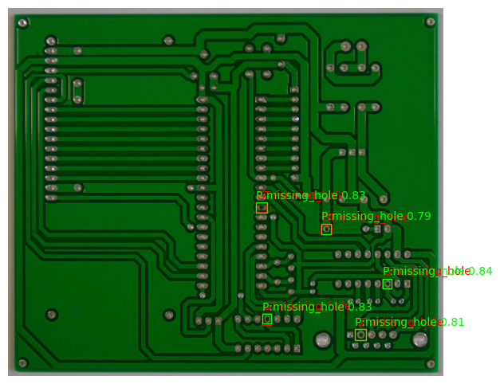
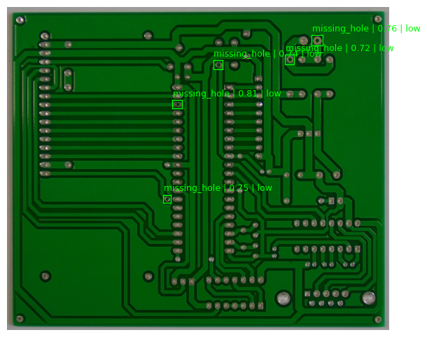
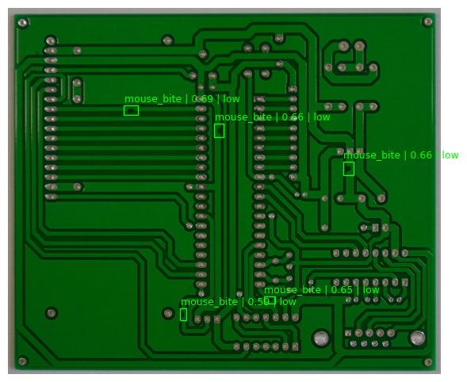
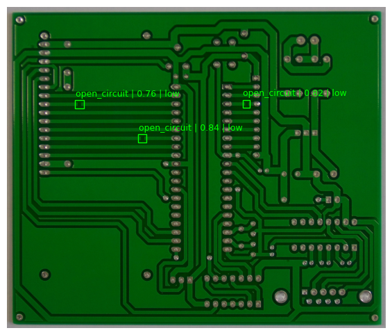
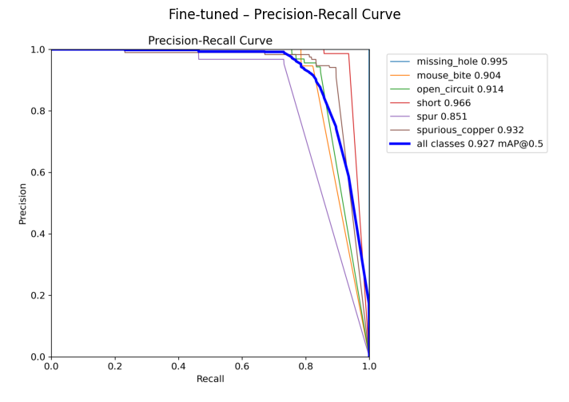
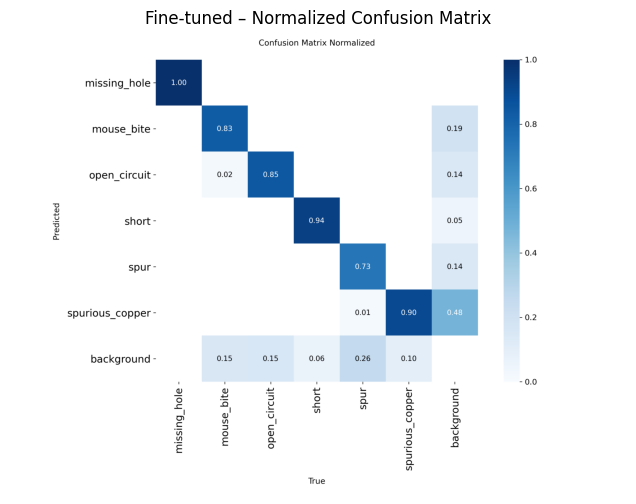
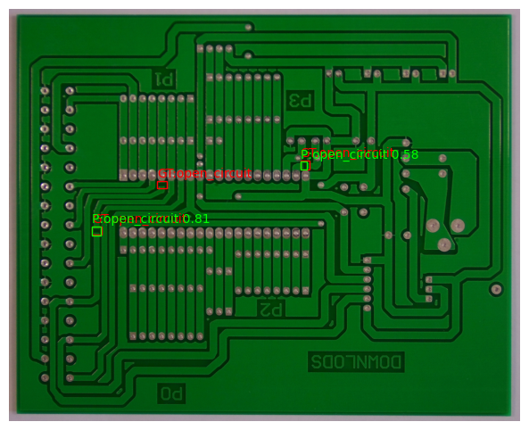

# Automated Quality Inspection System for PCB Manufacturing

## 1. Project Overview
This project implements an **automated visual quality inspection system** for **Printed Circuit Boards (PCBs)** using deep learning–based computer vision.  
The system is designed to detect defects **before packaging**, localize them precisely, classify defect types, and provide interpretable outputs suitable for manufacturing environments.

### Example PCB Defect Detection Output

*Example output showing detected PCB defects with bounding boxes, class labels, and confidence scores.*

## 2. Manufactured Item
- **Item chosen:** Printed Circuit Boards (PCBs)
- PCBs are a real-world manufactured product with visually identifiable defects and strict quality requirements.

## 3. Dataset
- **Source:** Public PCB defect dataset (Kaggle)
- **Image type:** Real PCB images
- **Annotations:** Bounding boxes (converted to YOLO format)

### Defect Types (6 total)
- `missing_hole`
- `mouse_bite`
- `open_circuit`
- `short`
- `spur`
- `spurious_copper`

### Defect-Free Samples
- Separate defect-free PCB images are included and evaluated to verify that the system does **not hallucinate defects**.

### Sample Defect Types from Dataset

*Examples of different PCB defect types present in the dataset.*

## 4. Model and Approach
- **Model:** YOLOv8s (Ultralytics)
- **Pretraining:** COCO dataset
- **Fine-tuning:** PCB defect dataset
- **Inference:** GPU (CUDA-enabled)

YOLOv8 was selected for its:
- real-time inference capability,
- strong localization performance,
- suitability for industrial inspection tasks.

## 5. Inspection Script Capabilities (Requirement Mapping)

The inspection script fulfills **all required tasks**:

### 5.1 Input Image Analysis
- Accepts a single PCB image as input.
- Performs end-to-end inference using a trained YOLOv8 model.

### 5.2 Defect Detection & Localization
- Detects defect regions using **bounding boxes**.
- Bounding box coordinates are extracted in pixel space.

### 5.3 Defect Classification with Confidence
- Each detected defect is classified into one of the defined defect types.
- A confidence score is provided for every detection.

### 5.4 Defect Center Coordinates & Severity
For each detected defect, the script outputs:
- **Center coordinates:** `(x, y)` in pixel space  
- **Severity level:** `low`, `medium`, or `high`

Severity is estimated heuristically using the ratio: `defect_area / image_area`.
Thresholds are calibrated specifically for PCB-scale defects.

## 6. Evaluation Results

### 6.1 Quantitative Performance

| Metric | Before Fine-Tuning | After Fine-Tuning |
|------|------------------|------------------|
| Precision | 0.00 | **0.958** |
| Recall | 0.00 | **0.872** |
| mAP@0.5 | 0.00 | **0.927** |
| mAP@0.5:0.95 | 0.00 | **0.530** |
| Inference Time | ~9.9 ms | **~4.4 ms** |

**Observation:**  
The pretrained model fails due to domain mismatch. Fine-tuning enables accurate and reliable PCB defect detection.

### Evaluation Visualizations

*Precision–Recall curve and confusion matrix for the fine-tuned model on the validation set.*

## 7. Failure Analysis
Failure cases were explicitly analyzed:
- **Missed detections:** Extremely small or low-contrast defects
- **Low-confidence predictions:** Ambiguous defect regions

Ground-truth and predicted bounding boxes were overlaid to visually inspect these cases.  
No medium or high severity defects were missed.
### Failure Case Visualization

*Ground-truth (red) and predicted (green) bounding boxes overlaid for a low-confidence or missed detection case.*

## 8. Conclusion
This project demonstrates a **complete automated quality inspection pipeline** for PCB manufacturing, covering:
- defect detection,
- localization,
- classification,
- severity estimation,
- and failure analysis.

The results highlight the importance of **domain-specific fine-tuning** for industrial vision tasks and show that **YOLOv8 can achieve accurate, real-time PCB defect inspection** when properly adapted.

The system is efficient, interpretable, and suitable for real-world PCB inspection scenarios.

